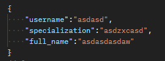

HALYK LIFE TEST TASK:

Create a REST API for 3 objects:
- Author
- Book
- Member (Reader)

 Conditions:
1. Create a REST API interface, all entities can be stored in memory
2. Integrate with the Postgres database
3. Launch the service in docker

how to create:

book

author

how to add a book to a member's list

